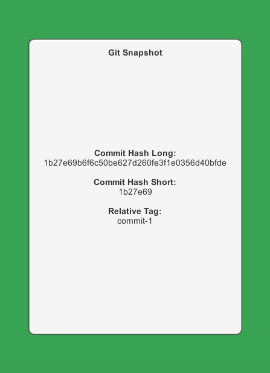

# Git Snaphot for Unity

## Structure

```
+-- [Plugin Root]        // Plugin can be placed anywhere below the Assets directory.
|   +-- Scenes           // Contains an example scene for reference.
|   +-- Scripts          // Contains all Unity-specific scripts.
|   |   +-- Editor       // Contains all Unity Editor-specific scripts.

+-- Assets
|   +-- Resources        
|   |   +-- GitSnapshot  // Contains generated file(s).
```

## Usage

Include the `/Unity` subfolder in your `Assets` folder of your Unity project. Any folder hierarchy is acceptable.
Include the following compilation flag in Player Prefs: `UNITY_GITSNAP`.

A new menu item will appear in the Unity Editor menu bar: `Tools/Git Reader`. The following menu entries are available:

- **Create Snapshot**: Creates/updates the snapshot with the latest repository state. This file will be written to `Assets/Resources/GitSnapshot`.
- **Auto-Update on Compile**: If true, a snaphsot will be automatically created/updated on recompilation.

Additionally, a build post-processor will ensure that the latest snapshot is captured when a build is created.

Make use of the `GitInterface` to access the snapshot details. An example scene and script have been included for reference:




## Troubleshooting

**Errors can cocur under the following conditions:**

- No Git repository exists at the root of the Unity project.
- A repository exists, but no commits are found (i.e. empty repository)
- A repository exists and commits are present, but no tags exist. This will result in the following error: